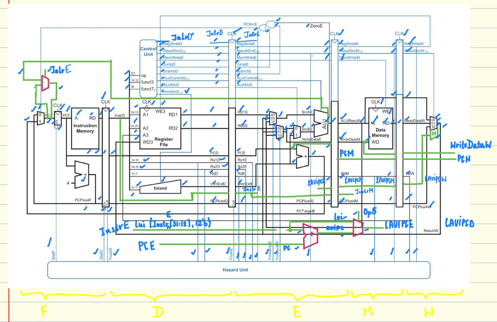

# 5-Stage Pipelined RISC-V Core Architecture

This document details the microarchitecture of the 5-stage pipelined RV32I processor with hazard unit dealing with data forward and control hazards.

## 1. Pipeline Overview

The processor implements a classic 5-stage pipeline with the following stages:
- **Fetch (F)**: Instruction fetch from memory
- **Decode (D)**: Instruction decode and register file read
- **Execute (E)**: ALU operations and branch resolution
- **Memory (M)**: Data memory access
- **Writeback (W)**: Register file write


<div align="center"></div>

---

## 2. Control Unit Logic

The Control Unit generates control signals based on instruction decoding, with signals propagated through pipeline registers.

### 2.1. Main Decoder

The main decoder generates primary control signals based on the instruction opcode. These signals are then passed through pipeline registers to control subsequent stages.

| Instruction | Opcode | RegWrite | ImmSrc | ALUSrc | MemWrite | ResultSrc | ALUOp | Jump | Jalr | Branch |
| :---: | :---: | :---: | :---: | :---: | :---: | :---: | :---: | :---: | :---: | :---: |
| R-type | `0110011` | 1 | xx | 0 | 0 | 00 | 10 | 0 | 0 | 0 |
| `lw` | `0000011` | 1 | 00 | 1 | 0 | 01 | 00 | 0 | 0 | 0 |
| `sw` | `0100011` | 0 | 01 | 1 | 1 | xx | 00 | 0 | 0 | 0 |
| `branch` | `1100011` | 0 | 10 | 0 | 0 | xx | 01 | 0 | 0 | 1 |
| I-type ALU | `0010011` | 1 | 00 | 1 | 0 | 00 | 10 | 0 | 0 | 0 |
| `jal` | `1101111` | 1 | 11 | 0 | 0 | 10 | 00 | 1 | 0 | 0 |
| `jalr` | `1100111` | 1 | 00 | 1 | 0 | 10 | 00 | 0 | 1 | 0 |
| `auipc` | `0010111` | 1 | 11 | 0 | 0 | 00 | 00 | 0 | 0 | 0 |
| `lui` | `0110111` | 1 | 11 | x | 0 | 11 | xx | 0 | 0 | 0 |

### 2.2. Branch Decoding Unit

The branching unit evaluates branch conditions in the Execute stage based on ALU flags and funct3 field.

| Branch Type | Opcode | funct3 | Condition | Description |
| :---: | :---: | :---: | :---: | :---: |
| `beq` | `1100011` | `000` | Zero | Branch if equal |
| `bne` | `1100011` | `001` | !Zero | Branch if not equal |
| `blt` | `1100011` | `100` | ALUR31 | Branch if less than (signed) |
| `bge` | `1100011` | `101` | !ALUR31 | Branch if greater/equal (signed) |
| `bltu` | `1100011` | `110` | Overflow | Branch if less than (unsigned) |
| `bgeu` | `1100011` | `111` | !Overflow | Branch if greater/equal (unsigned) |

### 2.3. ALU Decoder

The ALU Decoder generates the `ALUControl` signal based on `ALUOp`, `funct3`, and `funct7[5]` fields.

| ALUOp | funct3 | funct7[5] | ALUControl | Operation |
| :---: | :----: | :-------: | :--------: | :-------: |
| `00` | `xxx` | `x` | `0000` | ADD |
| `01` | `xxx` | `x` | `0001` | SUB |
| `10` | `000` | `0` | `0000` | ADD |
| `10` | `000` | `1` | `0001` | SUB |
| `10` | `001` | `x` | `0111` | SLL |
| `10` | `010` | `x` | `0101` | SLT |
| `10` | `011` | `x` | `0110` | SLTU |
| `10` | `100` | `x` | `0100` | XOR |
| `10` | `101` | `0` | `1000` | SRL |
| `10` | `101` | `1` | `1001` | SRA |
| `10` | `110` | `x` | `0011` | OR |
| `10` | `111` | `x` | `0010` | AND |

---

## 3. Hazard Detection and Resolution

### 3.1. Hazard Unit Control Logic

The hazard unit handles three types of hazards through different mechanisms:

| Hazard Type | Detection Condition | Resolution Method |
| :---: | :---: | :---: |
| **Data Hazard (RAW)** | `(RsE == RdM/RdW) & RegWrite` | Forwarding |
| **Load-Use Hazard** | `ResultSrcE & (Rs1D/Rs2D == RdE)` | Stalling |
| **Control Hazard** | `PCSrcE` (Branch/Jump taken) | Flushing |

### 3.2. Forwarding Unit Truth Table

| Forwarding Condition | ForwardAE/ForwardBE | Data Source |
| :---: | :---: | :---: |
| No hazard | `00` | Register file output |
| EX/MEM forwarding | `10` | ALU result from Memory stage |
| MEM/WB forwarding | `01` | Write-back data |

**Forwarding Logic:**
- `ForwardAE = 10` when `(Rs1E == RdM) & RegWriteM & (Rs1E != 0)`
- `ForwardAE = 01` when `(Rs1E == RdW) & RegWriteW & (Rs1E != 0)`
- Similar logic applies to `ForwardBE` for `Rs2E`

### 3.3. Stall and Flush Conditions

| Signal | Condition | Purpose |
| :---: | :---: | :---: |
| `StallF` | `lwStall` | Stall PC update |
| `StallD` | `lwStall` | Stall Decode stage |
| `FlushE` | `lwStall \| PCSrcE` | Clear Execute stage |
| `FlushD` | `PCSrcE` | Clear Decode stage |

Where `lwStall = ResultSrcE & ((Rs1D == RdE) | (Rs2D == RdE))`

---

## 4. ALU Operations

The ALU supports the following operations with corresponding control signals:

| ALUControl | Operation | Description |
| :---: | :---: | :---: |
| `0000` | ADD | Addition |
| `0001` | SUB | Subtraction |
| `0010` | AND | Bitwise AND |
| `0011` | OR | Bitwise OR |
| `0100` | XOR | Bitwise XOR |
| `0101` | SLT | Set less than (signed) |
| `0110` | SLTU | Set less than (unsigned) |
| `0111` | SLL | Shift left logical |
| `1000` | SRL | Shift right logical |
| `1001` | SRA | Shift right arithmetic |

**ALU Flags:**
- `Zero`: Set when ALU result is zero
- `Overflow`: Used for unsigned comparison (set when `a < b`)
- `ALUR31`: MSB of ALU result (used for signed comparison)

---

## 5. Verification Example

Example showing pipeline execution with hazard handling:

```assembly
addi x5, x0, 10    # No hazards
addi x6, x0, 20    # No hazards  
add  x7, x5, x6    # RAW hazard on x5, x6 - resolved by forwarding
sw   x7, 0(x0)     # RAW hazard on x7 - resolved by forwarding
```

| Cycle | F | D | E | M | W |
| :---: | :---: | :---: | :---: | :---: | :---: |
| 1 | `addi x5, x0, 10` | - | - | - | - |
| 2 | `addi x6, x0, 20` | `addi x5, x0, 10` | - | - | - |
| 3 | `add x7, x5, x6` | `addi x6, x0, 20` | `addi x5, x0, 10` | - | - |
| 4 | `sw x7, 0(x0)` | `add x7, x5, x6` (fwd) | `addi x6, x0, 20` | `addi x5, x0, 10` | - |
| 5 | - | `sw x7, 0(x0)` (fwd) | `add x7, x5, x6` | `addi x6, x0, 20` | `addi x5, x0, 10` |

---
